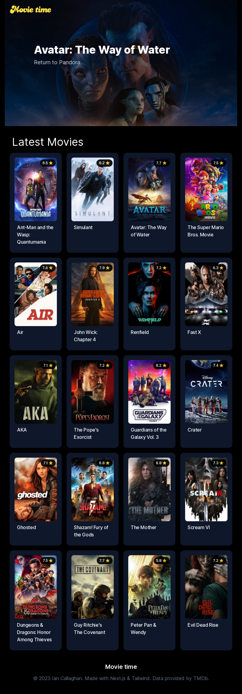

## Movie time

- A Movie database website using React and Next.js 13 new features such as server components and API calls using fetch on the server.

## Features

- Uses Next.js 13 (Server components)
- Uses API calls on the server using Next 13 App Fetch
- Uses Tailwind CSS v3.x for styling

## Todo

- Add loading and error states
- Add some simple animations
- Rate limiting using upstash redis
- Add trailers to videos
- Add Extra movie information

## License

[MIT licensed](LICENSE)
